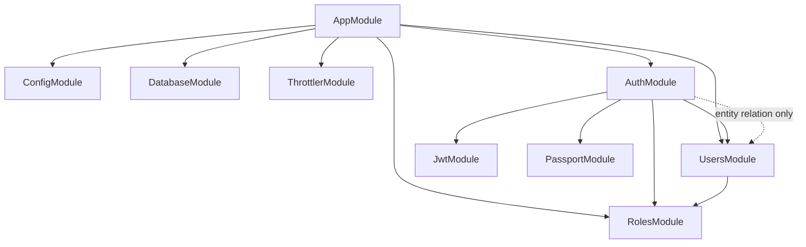
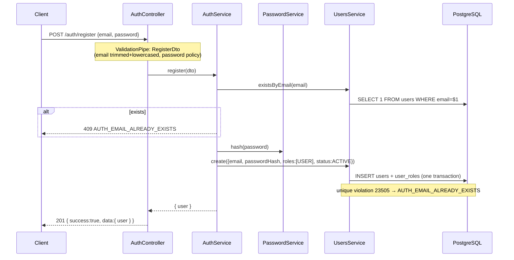
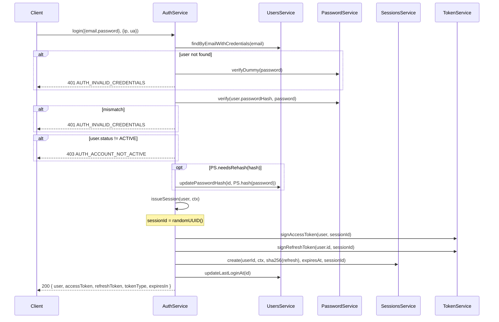
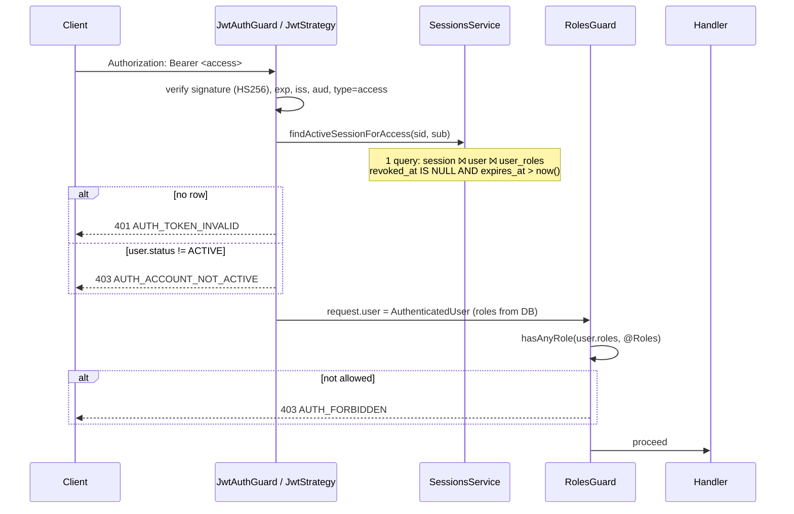
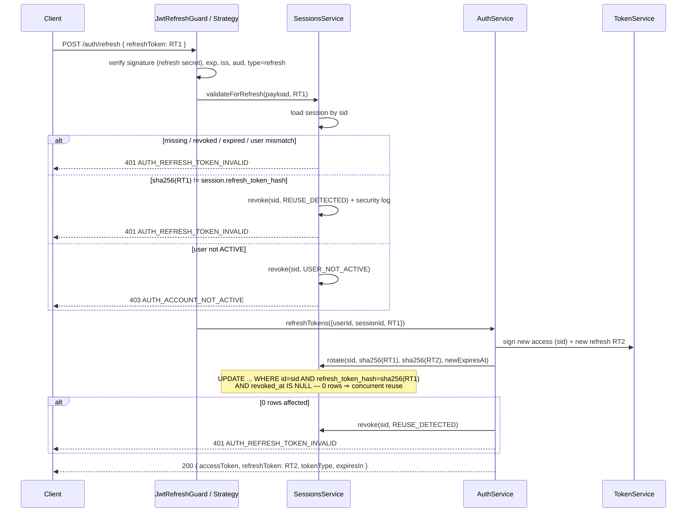

# Authentication Architecture

| Field | Value |
|---|---|
| Document | AUTH_ARCHITECTURE |
| Status | Draft for implementation |
| Related | [AUTH_REQUIREMENTS](./AUTH_REQUIREMENTS.md) · [AUTH_DATABASE](./AUTH_DATABASE.md) · [JWT_SPEC](./JWT_SPEC.md) · [AUTH_SECURITY](./AUTH_SECURITY.md) · [AUTH_API](./AUTH_API.md) · [AUTH_IMPLEMENTATION_PLAN](./AUTH_IMPLEMENTATION_PLAN.md) |

## 1. Baseline and conflict policy

### 1.1 Detected repository state

Inspection on 2026-09-24 found an **empty repository**: no commits, no `package.json`, no `src/`. Nothing exists to reuse, replace or refactor:

| Item | Detected | Decision in this spec |
|---|---|---|
| NestJS version | none | NestJS 12.x (Express) |
| Node.js version | none (sandbox: 22.x) | Node LTS ≥ 22, `.nvmrc` pinned to 24 |
| Package manager | none | npm |
| ORM / database | none | TypeORM 1.x + PostgreSQL |
| Existing modules | none | `auth`, `users`, `roles` + infrastructure |
| Existing auth code | none | built from scratch |
| Validation library | none | `class-validator` + `class-transformer` |
| Config system | none | `@nestjs/config` + Joi |
| Env conventions | none | `UPPER_SNAKE_CASE`, grouped by prefix (`JWT_`, `AUTH_`, `DATABASE_`, `THROTTLE_`) |
| Testing | none | Jest (unit, `*.spec.ts` next to source) + Supertest (e2e, `test/*.e2e-spec.ts`) |
| Coding conventions | none | Nest CLI defaults: kebab-case filenames, `*.module/controller/service.ts`, ESLint + Prettier |

### 1.2 If code exists when implementation starts

Phase 1 of the plan re-runs this inspection. If the project was scaffolded or already has auth code, the implementing agent MUST:

1. Analyze the existing implementation and list it in the plan's `Baseline` section.
2. Keep existing conventions that do not violate AUTH_SECURITY (for example, keep Prisma instead of TypeORM, keep `bcrypt` if it is already standardized, keep an existing folder layout).
3. Document every conflict in a table: *existing → proposed → minimum change → justification*.
4. Recommend the **minimum** change. Security-violating code (plaintext passwords, unhashed refresh tokens, a single shared JWT secret, etc.) MUST be replaced. Everything else is adapted.
5. Never do destructive refactors (renaming tables, deleting modules, rewriting migrations that already ran) without a written justification and a migration path.

The rest of this document is **ORM-neutral where possible**. Only files named `*.repository.ts`, `*.entity.ts`, `database/**` and `database.config.ts` depend on TypeORM.

## 2. System overview

```
┌──────────────────────────────┐
│  Frontend / Client           │   React / Next.js / Mobile / Server-to-server
└──────────────┬───────────────┘
               │ HTTPS · JSON · Authorization: Bearer <accessToken>
               ▼
┌─────────────────────────────────────────────────────────────────────────┐
│ NestJS Backend                                                          │
│                                                                         │
│  helmet → CORS → ThrottlerGuard → JwtAuthGuard → RolesGuard →           │
│  ValidationPipe → Controller → Service → Repository → DB                │
│  ResponseEnvelopeInterceptor (success) · AllExceptionsFilter (errors)   │
│                                                                         │
│  ┌──────────────── AuthModule ────────────────┐   ┌──── UsersModule ───┐ │
│  │ AuthController   SessionsController*       │   │ UsersController*   │ │
│  │ AuthService (orchestrator)                 │──▶│ UsersService       │ │
│  │ PasswordService  TokenService              │   │ UsersRepository    │ │
│  │ SessionsService  SessionsRepository        │   │ UserEntity         │ │
│  │ JwtStrategy  JwtRefreshStrategy            │   │ UserRoleEntity     │ │
│  │ JwtAuthGuard JwtRefreshGuard RolesGuard    │   └─────────┬──────────┘ │
│  │ @CurrentUser @Roles @Auth                  │             │            │
│  └───────┬──────────────────────┬─────────────┘             │            │
│          │                      ▼                           │            │
│          │              ┌── RolesModule ──┐                 │            │
│          │              │ Role enum       │                 │            │
│          │              │ RolesService    │                 │            │
│          │              └─────────────────┘                 │            │
│          ▼                                                  ▼            │
│  ┌───────────────────────── PostgreSQL ────────────────────────────────┐ │
│  │ users · user_roles · auth_sessions                                  │ │
│  └─────────────────────────────────────────────────────────────────────┘ │
└─────────────────────────────────────────────────────────────────────────┘
 * SHOULD-level components
```

## 3. Modules and responsibilities

### 3.1 AuthModule (`src/modules/auth`)

Answers **"who is this caller?"** and owns everything about credentials, tokens and sessions. It also hosts the authorization *guard* and *decorator*. The authorization *rules* live in RolesModule.

| Responsibility | Component |
|---|---|
| Registration, login, logout, refresh orchestration | `AuthService` |
| Password hashing and verification (Argon2id) | `PasswordService` |
| Signing and verifying access/refresh JWTs | `TokenService` |
| Session lifecycle (create, rotate, revoke, look up) | `SessionsService` + `SessionsRepository` |
| Access-token validation | `JwtStrategy` + `JwtAuthGuard` |
| Refresh-token validation | `JwtRefreshStrategy` + `JwtRefreshGuard` |
| Role enforcement | `RolesGuard` (delegates to `RolesService`) |
| Request helpers | `@CurrentUser()`, `@Roles()`, `@Auth()` |
| HTTP surface | `AuthController`, `SessionsController` (SHOULD) |

AuthModule MUST NOT:
- access the `users` / `user_roles` tables directly. It goes through `UsersService`.
- return entities. It returns DTOs built by mappers.

### 3.2 UsersModule (`src/modules/users`)

Owns the **user record**: persistence, retrieval, updates, status and role assignment. It knows nothing about passwords beyond storing and returning an opaque `passwordHash` string. It knows nothing about tokens or sessions.

| Responsibility | Component |
|---|---|
| CRUD on users + roles, email normalization, uniqueness | `UsersService` |
| TypeORM access to `users` and `user_roles` | `UsersRepository` |
| Persistence models | `UserEntity`, `UserRoleEntity` |
| Public representation | `UserResponseDto` + `toUserResponse()` mapper |
| Admin HTTP endpoints | `UsersController` (SHOULD: `GET /users`) |

UsersModule MUST NOT import AuthModule. It MUST NOT hash passwords (AuthModule passes it a finished hash).

### 3.3 RolesModule (`src/modules/roles`)

Answers **"what may this caller do?"** at the role level.

| Component | Responsibility |
|---|---|
| `role.enum.ts` | `Role` enum (`USER`, `ADMIN`, `SUPER_ADMIN`) — imported as a plain TS type by any module |
| `RolesService` | Role hierarchy, `expand(roles)`, `hasAnyRole(userRoles, required)` |
| `RolesModule` | Provides and exports `RolesService`. Has no dependencies. |

### 3.4 Infrastructure

| Module / folder | Responsibility |
|---|---|
| `ConfigModule` (global) | Loads `app`, `auth`, `database`, `jwt` namespaces and validates env with Joi |
| `DatabaseModule` (`src/database`) | `TypeOrmModule.forRootAsync` using the `database` config, CLI `data-source.ts`, migrations, seeds |
| `ThrottlerModule` | Global rate limiting (`APP_GUARD` → `ThrottlerGuard`) |
| `common/` | Cross-cutting pieces with **no** feature knowledge: exception filter, response interceptor, `AppException`, error codes, `@ClientContext()` decorator |

## 4. Dependency rules



Rules (MUST):

1. Dependencies point **one way**: `Auth → Users → Roles`, `Auth → Roles`. Never `Users → Auth` at the module (DI) level. No `forwardRef()` anywhere.
2. `UsersModule` exports `UsersService` only, not the repository and not entities for writing.
3. `AuthModule` exports `SessionsService` (for future modules such as password reset), `JwtAuthGuard` and `RolesGuard`.
4. Guards and decorators in `modules/auth/{guards,decorators}` are the **public auth API** for every feature module. A feature module (including `UsersController`) MAY import these *files*. Doing so creates no DI cycle, because:
   - `JwtAuthGuard` and `JwtRefreshGuard` have no constructor dependencies (Passport strategies register globally by name).
   - `RolesGuard` depends only on `Reflector` and `RolesService`, so the consuming module MUST import `RolesModule`.
5. `common/` MUST NOT import from `modules/`.
6. Only repositories import TypeORM (`@InjectRepository`, `Repository`, `DataSource`). Services depend on repositories. This keeps the ORM swappable.
7. `AuthSessionEntity` has a `ManyToOne` to `UserEntity` (a TS import from `modules/users/entities`). This is the only allowed file-level coupling from auth into users internals.

## 5. Directory structure

Paths in bold are SHOULD-level. Everything else is MUST.

```
.
├── .env.example
├── .nvmrc
├── docker-compose.yml                         (SHOULD: postgres for dev + e2e)
├── package.json
├── test/
│   ├── jest-e2e.json
│   ├── utils/
│   │   ├── create-test-app.ts                 (builds app via AppModule + configureApp)
│   │   └── reset-database.ts                  (truncates tables between tests)
│   ├── auth.e2e-spec.ts
│   ├── sessions.e2e-spec.ts                   (SHOULD)
│   └── users.e2e-spec.ts                      (SHOULD)
└── src/
    ├── main.ts                                (bootstrap only: create app, configureApp, listen)
    ├── app.module.ts
    ├── app.setup.ts                           (configureApp(app): helmet, CORS, prefix, trust proxy, body limit, shutdown hooks)
    │
    ├── config/
    │   ├── app.config.ts                      (registerAs('app'): env, port, prefix, cors, trustProxy, throttle)
    │   ├── auth.config.ts                     (registerAs('auth'): argon2 params)
    │   ├── database.config.ts                 (registerAs('database'): url, ssl, logging)
    │   ├── jwt.config.ts                      (registerAs('jwt'): secrets, expiries, issuer, audience)
    │   ├── env.validation.ts                  (Joi schema; exported for ConfigModule.forRoot)
    │   └── duration.util.ts                   (parseDurationToSeconds('15m') → 900)
    │
    ├── database/
    │   ├── database.module.ts
    │   ├── data-source.ts                     (TypeORM CLI DataSource; reads process.env)
    │   ├── migrations/
    │   │   ├── <timestamp>-InitUsersAndRoles.ts
    │   │   └── <timestamp>-CreateAuthSessions.ts
    │   └── seeds/
    │       └── seed-super-admin.ts            (SHOULD)
    │
    ├── common/
    │   ├── constants/
    │   │   └── error-codes.ts                 (ErrorCode enum — catalogue in AUTH_API §2.4)
    │   ├── decorators/
    │   │   └── client-context.decorator.ts    (@ClientContext() → { ipAddress, userAgent })
    │   ├── exceptions/
    │   │   └── app.exception.ts               (AppException(status, code, message, details?))
    │   ├── filters/
    │   │   └── all-exceptions.filter.ts
    │   ├── interceptors/
    │   │   └── response-envelope.interceptor.ts
    │   ├── pipes/
    │   │   └── validation.pipe.ts             (factory: createValidationPipe())
    │   ├── guards/                            (reserved: non-auth guards)
    │   └── types/
    │       └── client-context.type.ts
    │
    └── modules/
        ├── auth/
        │   ├── auth.module.ts
        │   ├── auth.controller.ts
        │   ├── auth.service.ts
        │   ├── auth.constants.ts              (strategy names, dummy-hash seed, throttle limits, password regex)
        │   ├── auth.errors.ts                 (factory helpers: AuthErrors.invalidCredentials() …)
        │   ├── services/
        │   │   ├── password.service.ts
        │   │   └── token.service.ts
        │   ├── sessions/
        │   │   ├── sessions.service.ts
        │   │   ├── sessions.repository.ts
        │   │   ├── sessions.controller.ts     (SHOULD)
        │   │   ├── entities/
        │   │   │   └── auth-session.entity.ts
        │   │   ├── enums/
        │   │   │   └── session-revoked-reason.enum.ts
        │   │   └── dto/
        │   │       └── session-response.dto.ts (SHOULD)
        │   ├── dto/
        │   │   ├── register.dto.ts
        │   │   ├── login.dto.ts
        │   │   ├── refresh-token.dto.ts
        │   │   ├── auth-response.dto.ts       (LoginResponseDto, TokensResponseDto, RegisterResponseDto)
        │   │   └── logout-response.dto.ts
        │   ├── guards/
        │   │   ├── jwt-auth.guard.ts
        │   │   ├── jwt-refresh.guard.ts
        │   │   └── roles.guard.ts
        │   ├── strategies/
        │   │   ├── jwt.strategy.ts
        │   │   └── jwt-refresh.strategy.ts
        │   ├── decorators/
        │   │   ├── current-user.decorator.ts
        │   │   ├── roles.decorator.ts
        │   │   └── auth.decorator.ts          (SHOULD: @Auth(...roles))
        │   ├── interfaces/
        │   │   └── jwt-payload.interface.ts   (AccessTokenPayload, RefreshTokenPayload)
        │   └── types/
        │       ├── authenticated-user.type.ts
        │       └── refresh-context.type.ts
        │
        ├── users/
        │   ├── users.module.ts
        │   ├── users.controller.ts            (SHOULD: GET /users for ADMIN)
        │   ├── users.service.ts
        │   ├── users.repository.ts
        │   ├── entities/
        │   │   ├── user.entity.ts
        │   │   └── user-role.entity.ts
        │   ├── enums/
        │   │   └── user-status.enum.ts
        │   ├── dto/
        │   │   ├── user-response.dto.ts
        │   │   └── list-users-query.dto.ts    (SHOULD)
        │   ├── mappers/
        │   │   └── user.mapper.ts             (toUserResponse(user))
        │   ├── types/
        │   │   └── user.types.ts              (User, UserWithCredentials, CreateUserInput)
        │   └── utils/
        │       └── normalize-email.ts
        │
        └── roles/
            ├── roles.module.ts
            ├── roles.service.ts
            └── role.enum.ts
```

Notes on deviations from the requested structure (all additive):

- `local.strategy.ts` / `LocalAuthGuard` are **not used**. In NestJS, guards run *before* pipes, so a Passport local guard would run before `LoginDto` validation. Credential logic would also end up inside a strategy. Login calls `AuthService.login()`, which calls `validateCredentials()` in the service layer instead. This keeps business logic out of guards and keeps validation errors consistent. A local strategy can still be added later as a thin wrapper around `validateCredentials()` if a Passport-based composite auth is needed.
- `services/`, `sessions/`, `auth.errors.ts`, `auth.constants.ts` and `types/refresh-context.type.ts` split what would otherwise be one large `auth.service.ts` into single-purpose units.
- `users/enums`, `users/mappers`, `users/types`, `users/utils` keep the entity out of the API surface.

## 6. Component contracts

Signatures are normative. Names, parameters and return types MUST match unless the plan's Baseline section documents a change.

### 6.1 Types

```ts
// modules/roles/role.enum.ts
export enum Role { USER = 'USER', ADMIN = 'ADMIN', SUPER_ADMIN = 'SUPER_ADMIN' }

// modules/users/enums/user-status.enum.ts
export enum UserStatus {
  ACTIVE = 'ACTIVE', INACTIVE = 'INACTIVE',
  SUSPENDED = 'SUSPENDED', PENDING_VERIFICATION = 'PENDING_VERIFICATION',
}

// modules/users/types/user.types.ts
export interface User {                 // domain shape returned by UsersService (never an entity)
  id: string; email: string; roles: Role[]; status: UserStatus;
  lastLoginAt: Date | null; createdAt: Date; updatedAt: Date;
}
export interface UserWithCredentials extends User { passwordHash: string } // ONLY for AuthService
export interface CreateUserInput { email: string; passwordHash: string; roles?: Role[]; status?: UserStatus }

// modules/auth/types/authenticated-user.type.ts
export type AuthenticatedUser = {       // what request.user holds after JwtAuthGuard
  id: string; email: string; roles: Role[]; status: UserStatus; sessionId: string;
};

// modules/auth/types/refresh-context.type.ts
export type RefreshContext = {          // what request.user holds after JwtRefreshGuard
  userId: string; sessionId: string; refreshToken: string; // raw token kept in memory only
};

// common/types/client-context.type.ts
export type ClientContext = { ipAddress: string | null; userAgent: string | null };
```

### 6.2 UsersService (exported)

```ts
findById(id: string): Promise<User | null>
findByEmail(email: string): Promise<User | null>                        // normalizes internally
findByEmailWithCredentials(email: string): Promise<UserWithCredentials | null>
existsByEmail(email: string): Promise<boolean>
create(input: CreateUserInput): Promise<User>                           // throws AUTH_EMAIL_ALREADY_EXISTS on unique violation
updatePasswordHash(id: string, passwordHash: string): Promise<void>
updateLastLoginAt(id: string, at?: Date): Promise<void>
updateStatus(id: string, status: UserStatus): Promise<User>              // SHOULD-level admin use
setRoles(id: string, roles: Role[]): Promise<User>                      // SHOULD-level admin use
list(query: { page: number; limit: number }): Promise<{ items: User[]; total: number }> // SHOULD
```

`UsersRepository` implements the TypeORM work and maps `UserEntity` → `User` / `UserWithCredentials`. `passwordHash` is selected **only** by `findByEmailWithCredentials` (column `select: false`, added explicitly with `addSelect`).

### 6.3 PasswordService

```ts
hash(plain: string): Promise<string>                           // argon2id with auth.argon2 params
verify(hash: string, plain: string): Promise<boolean>          // never throws on mismatch; false on malformed hash
needsRehash(hash: string): boolean
verifyDummy(plain: string): Promise<false>                     // timing equalizer; hash computed in onModuleInit
```

### 6.4 TokenService

```ts
signAccessToken(user: Pick<User,'id'|'email'|'roles'>, sessionId: string): Promise<string>
signRefreshToken(userId: string, sessionId: string): Promise<{ token: string; expiresAt: Date }>
hashRefreshToken(token: string): string                        // SHA-256 hex
compareRefreshTokenHash(token: string, storedHash: string): boolean // crypto.timingSafeEqual
get accessTokenTtlSeconds(): number
```

Strategies verify tokens themselves via `passport-jwt` with the options in JWT_SPEC §5. `TokenService` does not expose a generic `verify` to controllers.

### 6.5 SessionsService (exported)

```ts
create(userId: string, ctx: ClientContext, refreshTokenHash: string, expiresAt: Date, id: string): Promise<AuthSession>
findActiveSessionForAccess(sessionId: string, userId: string): Promise<{ session: AuthSession; user: User } | null>
validateForRefresh(payload: RefreshTokenPayload, rawToken: string): Promise<RefreshContext>   // throws; reuse ⇒ revoke
rotate(sessionId: string, expectedCurrentHash: string, newHash: string, newExpiresAt: Date): Promise<boolean> // false ⇒ lost race / reuse
revoke(sessionId: string, reason: SessionRevokedReason): Promise<number>
revokeAllForUser(userId: string, reason: SessionRevokedReason): Promise<number>
revokeAllExcept(userId: string, keepSessionId: string, reason: SessionRevokedReason): Promise<number>
listActiveForUser(userId: string): Promise<AuthSession[]>                                     // SHOULD
revokeOwned(userId: string, sessionId: string, reason: SessionRevokedReason): Promise<number> // SHOULD, 0 ⇒ 404
```

`AuthSession` is a domain interface mirroring `auth_sessions` columns (camelCase), with no `refreshTokenHash` outside the auth module.

### 6.6 AuthService (orchestrator)

```ts
register(dto: RegisterDto): Promise<RegisterResponseDto>
login(dto: LoginDto, ctx: ClientContext): Promise<LoginResponseDto>
validateCredentials(email: string, password: string): Promise<UserWithCredentials>   // throws 401/403
issueSession(user: User, ctx: ClientContext): Promise<TokensResponseDto>              // createSession + generateTokens
refreshTokens(refresh: RefreshContext): Promise<TokensResponseDto>
logout(user: AuthenticatedUser): Promise<LogoutResponseDto>
logoutAll(user: AuthenticatedUser): Promise<LogoutResponseDto>
getProfile(userId: string): Promise<UserResponseDto>
```

`createSession()` and `generateTokens()` from the requested design are private steps inside `issueSession()` and `refreshTokens()`:

```ts
private generateTokens(user, sessionId): Promise<{ accessToken; refreshToken; refreshTokenHash; refreshExpiresAt }>
private createSession(user, ctx): Promise<{ sessionId; tokens }>
```

`issueSession()` is the **single extension seam**. Every future way of proving identity (OAuth callback, MFA completion, magic link) ends by calling it.

### 6.7 RolesService

```ts
expand(roles: Role[]): Set<Role>            // SUPER_ADMIN → {SUPER_ADMIN, ADMIN, USER}; ADMIN → {ADMIN, USER}
hasAnyRole(userRoles: Role[], required: Role[]): boolean
```

The hierarchy is a constant map in `roles.service.ts`: `{ SUPER_ADMIN: [ADMIN], ADMIN: [USER], USER: [] }`, expanded transitively.

### 6.8 Guards, strategies, decorators

| Component | Contract |
|---|---|
| `JwtStrategy` (`'jwt'`) | `ExtractJwt.fromAuthHeaderAsBearerToken()`, options from JWT_SPEC §5.1. `validate(payload)` checks `payload.type === 'access'`, then calls `SessionsService.findActiveSessionForAccess(payload.sid, payload.sub)`. `null` → throw `AUTH_TOKEN_INVALID`. User not `ACTIVE` → throw `AUTH_ACCOUNT_NOT_ACTIVE`. Returns `AuthenticatedUser` with roles **from the DB**. |
| `JwtRefreshStrategy` (`'jwt-refresh'`) | `ExtractJwt.fromBodyField('refreshToken')`, `passReqToCallback: true`, options from JWT_SPEC §5.2. `validate(req, payload)` checks `payload.type === 'refresh'`, then calls `SessionsService.validateForRefresh(payload, rawToken)`. Returns `RefreshContext`. |
| `JwtAuthGuard` | `extends AuthGuard('jwt')`. Overrides `handleRequest(err, user, info)` to map Passport info: `TokenExpiredError` → `AUTH_TOKEN_EXPIRED`, `No auth token` → `AUTH_TOKEN_MISSING`, any other failure → `AUTH_TOKEN_INVALID`. An `AppException` thrown by the strategy passes through unchanged. |
| `JwtRefreshGuard` | `extends AuthGuard('jwt-refresh')`. `handleRequest` maps **every** failure except `AUTH_ACCOUNT_NOT_ACTIVE` to `AUTH_REFRESH_TOKEN_INVALID`. |
| `RolesGuard` | Reads `ROLES_KEY` metadata via `Reflector.getAllAndOverride([handler, class])`. No metadata → `true`. No `request.user` → `401 AUTH_TOKEN_MISSING`. `!rolesService.hasAnyRole(user.roles, required)` → `403 AUTH_FORBIDDEN`. |
| `@Roles(...roles: Role[])` | `SetMetadata(ROLES_KEY, roles)` |
| `@CurrentUser(key?)` | `createParamDecorator`. Returns `request.user` or `request.user[key]`. |
| `@Auth(...roles)` (SHOULD) | `applyDecorators(UseGuards(JwtAuthGuard, RolesGuard), Roles(...roles), ApiBearerAuth())` |

**Guard application pattern (decision):** guards are applied **explicitly per controller or route** with `@UseGuards(JwtAuthGuard)` / `@UseGuards(JwtAuthGuard, RolesGuard)` (or `@Auth()`), matching the requested usage examples. Only `ThrottlerGuard` is global. The alternative "global `JwtAuthGuard` + `@Public()` opt-out" is listed as a pending decision in the implementation plan. Adopting it later would change only `app.module.ts` and add `common/decorators/public.decorator.ts`.

Guard order when stacked: `JwtAuthGuard` MUST come before `RolesGuard`.

```ts
@Get('admin')
@Roles(Role.ADMIN)
@UseGuards(JwtAuthGuard, RolesGuard)
getAdminData() {}

@Get('me')
@UseGuards(JwtAuthGuard)
getMe(@CurrentUser() user: AuthenticatedUser) { return this.authService.getProfile(user.id); }
```

### 6.9 Controllers (thin)

Every handler body is **one** service call. Example:

```ts
@Post('login')
@HttpCode(200)
@Throttle({ default: AUTH_THROTTLE.login })
login(@Body() dto: LoginDto, @ClientContext() ctx: ClientContext) {
  return this.authService.login(dto, ctx);
}
```

Controllers return plain DTOs. `ResponseEnvelopeInterceptor` wraps them in `{ success: true, data }`.

## 7. Request pipeline

Order of execution for a request (NestJS semantics):

1. Express middleware: `helmet()`, CORS, JSON body parser (limit `100kb`).
2. Guards: `ThrottlerGuard` (global) → route guards (`JwtAuthGuard` → `RolesGuard`, or `JwtRefreshGuard`).
3. Pipes: global `ValidationPipe` (`whitelist`, `forbidNonWhitelisted`, `transform`, `transformOptions.enableImplicitConversion: false`) builds and validates DTOs. Failures become `400 VALIDATION_FAILED` through a custom `exceptionFactory`.
4. Controller → services → repositories.
5. `ResponseEnvelopeInterceptor` wraps the returned value.
6. `AllExceptionsFilter` turns any thrown error into the error envelope.

Global pipe, filter, interceptor and throttler guard MUST be registered as `APP_PIPE`, `APP_FILTER`, `APP_INTERCEPTOR`, `APP_GUARD` providers in `AppModule`. This way e2e tests that build the app from `AppModule` get identical behaviour. HTTP-level middleware (helmet, CORS, prefix, trust proxy) lives in `configureApp()` in `app.setup.ts`. Both `main.ts` and the e2e helper call it.

Because guards run before pipes, a missing or malformed `refreshToken` body field on `/auth/refresh` is rejected by `JwtRefreshGuard` with `401 AUTH_REFRESH_TOKEN_INVALID`, not `400`. This is intended and documented in AUTH_API.

## 8. Flows

### 8.1 Registration



### 8.2 Login



### 8.3 Authenticated request



### 8.4 Refresh with rotation and reuse detection



### 8.5 Session lifecycle

```
                 login                          refresh (hash matches)
   (none) ───────────────▶  ACTIVE  ◀──────────────────────────┐
                              │  └──────────────────────────────┘
                              │ logout / logout-all / revoke-others / DELETE /auth/sessions/:id
                              │ refresh with old (rotated) token  → REUSE_DETECTED
                              │ user not ACTIVE on refresh        → USER_NOT_ACTIVE
                              ▼
                           REVOKED (revoked_at set, terminal)
   ACTIVE ── expires_at passes ──▶ EXPIRED (implicit, terminal)
   REVOKED / EXPIRED ── retention (30 d) ──▶ purged (SHOULD)
```

One device or client = one session row. The row id (`sid`) stays stable across rotations, so a user's device list stays stable and one device can be revoked without touching the others.

### 8.6 Logout variants

| Endpoint | Guard | Service call | Effect |
|---|---|---|---|
| `POST /auth/logout` | JwtAuthGuard | `sessions.revoke(user.sessionId, LOGOUT)` | Current device signed out |
| `POST /auth/logout-all` | JwtAuthGuard | `sessions.revokeAllForUser(user.id, LOGOUT_ALL)` | All devices signed out, including this one |
| `POST /auth/sessions/revoke-others` (SHOULD) | JwtAuthGuard | `sessions.revokeAllExcept(user.id, user.sessionId, LOGOUT_OTHERS)` | All other devices signed out |
| `DELETE /auth/sessions/:id` (SHOULD) | JwtAuthGuard | `sessions.revokeOwned(user.id, id, LOGOUT)` | That device signed out |

Access tokens are checked against their session on every request (§8.3). So revocation takes effect **immediately** for access tokens too, not only when they expire.

## 9. Error model inside the code

- Throw `AppException` (from `common/exceptions/app.exception.ts`) with an `ErrorCode`. Use the helpers in `auth.errors.ts`, for example `throw AuthErrors.invalidCredentials()`, so status, code and message never drift.
- Repositories translate DB errors they understand (`23505` unique violation on `users_email_key`) into domain errors. Everything else propagates and ends as `500 INTERNAL_ERROR`.
- `AllExceptionsFilter` handles `AppException`, Nest `HttpException` (including throttler `429` → `RATE_LIMITED`) and unknown errors. It logs unknown errors with stack at `error` level. It never logs request bodies.

## 10. Configuration namespaces

```ts
// jwt.config.ts
export default registerAs('jwt', () => ({
  access:  { secret: env.JWT_ACCESS_SECRET,  expiresIn: env.JWT_ACCESS_EXPIRES_IN ?? '15m' },
  refresh: { secret: env.JWT_REFRESH_SECRET, expiresIn: env.JWT_REFRESH_EXPIRES_IN ?? '7d' },
  issuer: env.JWT_ISSUER ?? 'nestjs-boilerplate',
  audience: env.JWT_AUDIENCE ?? 'nestjs-boilerplate-api',
}));
```

Consumers inject typed config with `@Inject(jwtConfig.KEY) private readonly jwt: ConfigType<typeof jwtConfig>`. `ConfigService.get('...')` string lookups are not allowed in auth code.

## 11. Extensibility map

| Future feature | What is added | What stays untouched |
|---|---|---|
| Email verification | `EmailVerificationModule`, token table, register sets `PENDING_VERIFICATION` | Login, JWT, sessions |
| Forgot/reset password | `PasswordResetModule` using `PasswordService.hash`, `UsersService.updatePasswordHash`, `SessionsService.revokeAllForUser` | Login, JWT |
| MFA | MFA challenge between `validateCredentials()` and `issueSession()` | Token/session model |
| OAuth (Google/Microsoft/GitHub) | Provider strategies + `auth_identities` table. The callback calls `issueSession()` | Sessions, JWT, guards |
| API keys / service accounts | `api-key` strategy + guard, `principalType` on `AuthenticatedUser` | User login |
| Permissions | `PermissionsGuard` + `@Permissions()`, resolved via `RolesService` | RolesGuard semantics |
| Tenants | `tid` claim, `tenant_id` on sessions, tenant guard | Password/login core |
| Cookie transport | Extractor in `JwtRefreshStrategy` + cookie writer in controller | Service layer |

## 12. Coding conventions

- Filenames kebab-case with Nest suffixes (`*.service.ts`, `*.guard.ts`, `*.strategy.ts`, `*.dto.ts`, `*.entity.ts`, `*.enum.ts`).
- Classes PascalCase. DTO classes end in `Dto`. Entities end in `Entity`.
- DB columns snake_case, TS properties camelCase (explicit `name:` on every `@Column`).
- No default exports except config factories created with `registerAs`.
- Unit tests `*.spec.ts` beside the file. E2E in `test/`.
- Every public method of a service has TSDoc.
