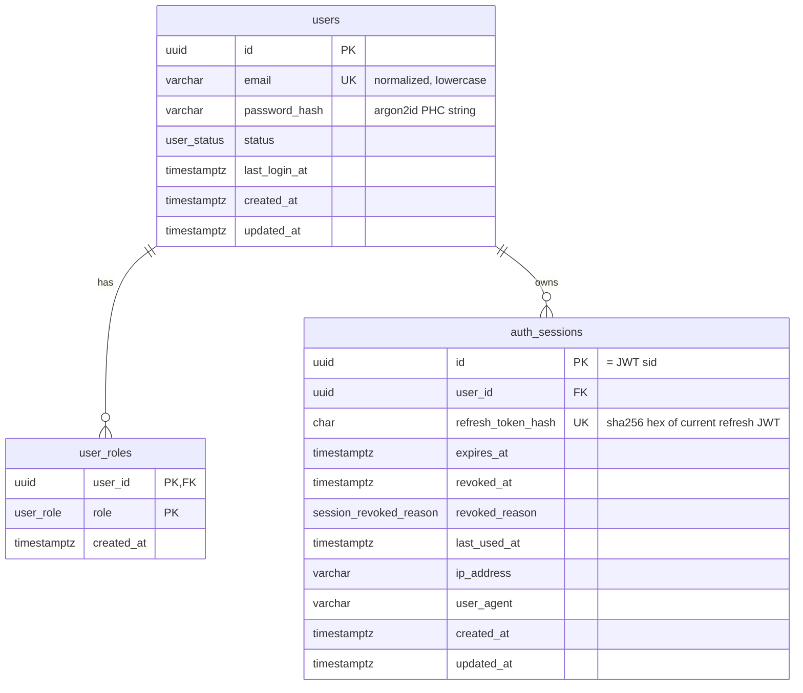

# Authentication Database Model

| Field | Value |
|---|---|
| Document | AUTH_DATABASE |
| Status | Draft for implementation |
| Engine | PostgreSQL ≥ 15 |
| ORM | TypeORM 1.x (`synchronize: false`, migrations only) |
| Related | [AUTH_ARCHITECTURE](./AUTH_ARCHITECTURE.md) · [JWT_SPEC](./JWT_SPEC.md) · [AUTH_SECURITY](./AUTH_SECURITY.md) |

## 1. Overview



Design principles:

- **Refresh tokens are never stored.** Only the SHA-256 hash of the *current* refresh token of each session is stored.
- **One row per device/client session.** The row id is the JWT `sid` claim. It stays stable across rotations.
- **Soft revocation.** `revoked_at` + `revoked_reason` are set. Rows are never updated back to active.
- **Roles in a join table**, so a user can hold several roles and new roles are an enum migration, not a schema redesign.
- All timestamps are `timestamptz` in UTC.

## 2. Enum types

| Postgres type | Values | TS enum |
|---|---|---|
| `user_status` | `ACTIVE`, `INACTIVE`, `SUSPENDED`, `PENDING_VERIFICATION` | `UserStatus` |
| `user_role` | `USER`, `ADMIN`, `SUPER_ADMIN` | `Role` |
| `session_revoked_reason` | `LOGOUT`, `LOGOUT_ALL`, `LOGOUT_OTHERS`, `REUSE_DETECTED`, `USER_NOT_ACTIVE`, `ADMIN_REVOKED` | `SessionRevokedReason` |

TypeORM enum columns MUST set `enumName` to these exact type names so migrations are deterministic. Adding a value later is a migration: `ALTER TYPE ... ADD VALUE`.

## 3. Tables

### 3.1 `users`

| Column | Type | Null | Default | Notes |
|---|---|---|---|---|
| `id` | `uuid` | no | `gen_random_uuid()` | PK |
| `email` | `varchar(254)` | no | — | Normalized (trim + lowercase) by the app. Unique. |
| `password_hash` | `varchar(255)` | no | — | Argon2id PHC string (`$argon2id$v=19$m=…`). TypeORM `select: false`. |
| `status` | `user_status` | no | `'ACTIVE'` | |
| `last_login_at` | `timestamptz` | yes | `NULL` | Set on successful login |
| `created_at` | `timestamptz` | no | `now()` | `@CreateDateColumn` |
| `updated_at` | `timestamptz` | no | `now()` | `@UpdateDateColumn` |

Constraints and indexes:

| Name | Definition | Purpose |
|---|---|---|
| `pk_users` | `PRIMARY KEY (id)` | |
| `uq_users_email` | `UNIQUE (email)` | Duplicate-email protection (FR-REG-06/07). The repository maps violations of this constraint name to `AUTH_EMAIL_ALREADY_EXISTS`. |
| `ck_users_email_lowercase` | `CHECK (email = lower(email))` | Guarantees normalization even if a future code path forgets it |
| `idx_users_status` | `(status)` | SHOULD: admin filtering |

### 3.2 `user_roles`

| Column | Type | Null | Default | Notes |
|---|---|---|---|---|
| `user_id` | `uuid` | no | — | FK → `users.id` `ON DELETE CASCADE` |
| `role` | `user_role` | no | — | |
| `created_at` | `timestamptz` | no | `now()` | |

| Name | Definition |
|---|---|
| `pk_user_roles` | `PRIMARY KEY (user_id, role)` — no duplicate role per user |
| `fk_user_roles_user` | `FOREIGN KEY (user_id) REFERENCES users(id) ON DELETE CASCADE` |
| `idx_user_roles_role` | `(role)` — list users by role |

Invariant (enforced in `UsersService`, not the DB): every user has **at least one** role. Registration inserts `USER` in the same transaction as the user row.

### 3.3 `auth_sessions`

| Column | Type | Null | Default | Notes |
|---|---|---|---|---|
| `id` | `uuid` | no | — | PK. **Generated by the app** (`crypto.randomUUID()`) before signing, because it is embedded in the tokens as `sid`. |
| `user_id` | `uuid` | no | — | FK → `users.id` `ON DELETE CASCADE` |
| `refresh_token_hash` | `char(64)` | no | — | Lowercase hex SHA-256 of the **current** refresh JWT. Replaced on every rotation. |
| `expires_at` | `timestamptz` | no | — | Equals the current refresh token's `exp`. Extended on rotation (sliding). |
| `revoked_at` | `timestamptz` | yes | `NULL` | `NULL` = not revoked |
| `revoked_reason` | `session_revoked_reason` | yes | `NULL` | |
| `last_used_at` | `timestamptz` | yes | `NULL` | Set on each successful refresh |
| `ip_address` | `varchar(45)` | yes | `NULL` | IPv4/IPv6 text form from `req.ip` at login (respecting `TRUST_PROXY`) |
| `user_agent` | `varchar(512)` | yes | `NULL` | Truncated to 512 chars by the app |
| `created_at` | `timestamptz` | no | `now()` | |
| `updated_at` | `timestamptz` | no | `now()` | |

| Name | Definition | Purpose |
|---|---|---|
| `pk_auth_sessions` | `PRIMARY KEY (id)` | Lookups by `sid` (every authenticated request and every refresh) |
| `fk_auth_sessions_user` | `FOREIGN KEY (user_id) REFERENCES users(id) ON DELETE CASCADE` | Deleting a user deletes their sessions |
| `uq_auth_sessions_refresh_token_hash` | `UNIQUE (refresh_token_hash)` | Defensive: a hash can belong to at most one session |
| `ck_auth_sessions_revocation` | `CHECK ((revoked_at IS NULL) = (revoked_reason IS NULL))` | Revocation always carries a reason |
| `idx_auth_sessions_user_active` | `(user_id) WHERE revoked_at IS NULL` (partial) | Logout-all, revoke-others, session listing |
| `idx_auth_sessions_expires_at` | `(expires_at)` | Purge job |

## 4. Relationships

| From | To | Cardinality | On delete |
|---|---|---|---|
| `user_roles.user_id` | `users.id` | many → one | CASCADE |
| `auth_sessions.user_id` | `users.id` | many → one | CASCADE |

TypeORM mapping:

- `UserEntity.roles: UserRoleEntity[]` — `@OneToMany(() => UserRoleEntity, r => r.user, { cascade: ['insert'] })`. Not eager. Repositories load it explicitly with `leftJoinAndSelect`.
- `AuthSessionEntity.user: UserEntity` — `@ManyToOne(() => UserEntity, { onDelete: 'CASCADE' })` + `@JoinColumn({ name: 'user_id' })`, plus a plain `@Column({ name: 'user_id' }) userId: string` so updates need no join.
- Entities never leave repositories. Repositories map them to the domain types from AUTH_ARCHITECTURE §6.1.

## 5. Revocation model

A session is **usable** only when `revoked_at IS NULL AND expires_at > now()`, and its user is `ACTIVE`.

| Event | Rows affected | `revoked_reason` |
|---|---|---|
| `POST /auth/logout` | the current session (`sid`) | `LOGOUT` |
| `POST /auth/logout-all` | every usable session of the user | `LOGOUT_ALL` |
| `POST /auth/sessions/revoke-others` (SHOULD) | every usable session except `sid` | `LOGOUT_OTHERS` |
| `DELETE /auth/sessions/:id` (SHOULD) | that session, if owned by the user | `LOGOUT` |
| Refresh with a token whose hash ≠ current hash, or losing the rotation race | that session | `REUSE_DETECTED` |
| Refresh while user is not `ACTIVE` | that session | `USER_NOT_ACTIVE` |
| Future admin action / password reset | one or all sessions | `ADMIN_REVOKED` (future: `PASSWORD_CHANGED`) |

Rules:

1. Revocation is **terminal**. No code path may set `revoked_at` back to `NULL`.
2. Revocation UPDATEs MUST include `AND revoked_at IS NULL`, so the first reason and timestamp are kept.
3. Status changes on `users` do not need to touch `auth_sessions`. Access and refresh checks read `users.status` every time.

## 6. Canonical queries

Repositories may use QueryBuilder or the Repository API, but the SQL they produce MUST match these semantics.

**Access-token session lookup** (`SessionsRepository.findActiveWithUser`), one round trip:

```sql
SELECT s.id, s.user_id, u.email, u.status, r.role
FROM auth_sessions s
JOIN users u        ON u.id = s.user_id
LEFT JOIN user_roles r ON r.user_id = u.id
WHERE s.id = $1 AND s.user_id = $2
  AND s.revoked_at IS NULL AND s.expires_at > now();
```

**Rotation** (`SessionsRepository.rotate`), atomic compare-and-swap:

```sql
UPDATE auth_sessions
SET refresh_token_hash = $newHash, expires_at = $newExpiresAt,
    last_used_at = now(), updated_at = now()
WHERE id = $sid AND refresh_token_hash = $currentHash
  AND revoked_at IS NULL AND expires_at > now();
-- affected = 1 ⇒ rotated; affected = 0 ⇒ treat as reuse ⇒ revoke(sid, REUSE_DETECTED)
```

**Revoke one / all / all-except:**

```sql
UPDATE auth_sessions SET revoked_at = now(), revoked_reason = $reason, updated_at = now()
WHERE id = $sid AND revoked_at IS NULL;

UPDATE auth_sessions SET revoked_at = now(), revoked_reason = $reason, updated_at = now()
WHERE user_id = $uid AND revoked_at IS NULL;                       -- all

UPDATE auth_sessions SET revoked_at = now(), revoked_reason = $reason, updated_at = now()
WHERE user_id = $uid AND id <> $keepSid AND revoked_at IS NULL;    -- all except current
```

**Purge** (SHOULD, `npm run db:purge-sessions` or a scheduled job):

```sql
DELETE FROM auth_sessions
WHERE (revoked_at IS NOT NULL AND revoked_at < now() - interval '30 days')
   OR (expires_at < now() - interval '30 days');
```

## 7. Migrations and seeds

- `src/database/data-source.ts` exports a `DataSource` for the TypeORM CLI (`entities: ['src/**/*.entity.ts']`, `migrations: ['src/database/migrations/*.ts']`).
- npm scripts (MUST): `migration:generate`, `migration:create`, `migration:run`, `migration:revert`. SHOULD: `seed`, `db:purge-sessions`.
- Two migrations, matching the implementation phases:
  - `<timestamp>-InitUsersAndRoles.ts` (Phase 2): enum types `user_status`, `user_role`, tables `users`, `user_roles`.
  - `<timestamp>-CreateAuthSessions.ts` (Phase 8): enum type `session_revoked_reason`, table `auth_sessions`.
  
  Together they MUST create every constraint and index above with the **exact names** listed. Each MUST have a working `down()` that drops its objects in reverse order.
- Migrations that have already run MUST never be edited. Changes go in new migrations.
- The app runs migrations as a deploy step (`npm run migration:run`), not `migrationsRun: true` at boot. E2E tests run migrations once in global setup.
- `seeds/seed-super-admin.ts` (SHOULD) upserts a user from `SEED_SUPER_ADMIN_EMAIL` / `SEED_SUPER_ADMIN_PASSWORD` with roles `[SUPER_ADMIN]`. It hashes with `PasswordService` via a standalone Nest application context and does nothing if the user already exists.

## 8. Data exposure rules

| Column | Exposed via API? |
|---|---|
| `users.id`, `email`, `status`, `created_at`, `updated_at`, roles | yes |
| `users.last_login_at` | yes, only on `/auth/me` and admin endpoints |
| `users.password_hash` | **never** (`select: false` + mapper allowlist) |
| `auth_sessions.id`, `created_at`, `last_used_at`, `ip_address`, `user_agent`, `expires_at` | only on the owner's `GET /auth/sessions` (SHOULD) |
| `auth_sessions.refresh_token_hash`, `revoked_reason` | **never** |

## 9. Future evolution (not now)

| Feature | Schema change |
|---|---|
| OAuth / social login | New `auth_identities (id, user_id FK, provider, provider_user_id, created_at, UNIQUE(provider, provider_user_id))`. `users.password_hash` becomes nullable. |
| Email verification / password reset | New `auth_tokens (id, user_id, purpose, token_hash, expires_at, used_at)`. Token hashing follows the refresh-token rule. |
| MFA | New `user_mfa_factors (id, user_id, type, secret_encrypted, confirmed_at)` |
| Absolute session lifetime | `auth_sessions.absolute_expires_at` |
| Fine-grained permissions | `permissions`, `role_permissions` tables. `user_role` enum may migrate to a `roles` table. |
| Tenants | `tenant_id` on `users`/`auth_sessions`. `uq_users_email` becomes `(tenant_id, email)`. |
| Audit log | `auth_events (id, user_id, session_id, event, ip_address, created_at)` |
